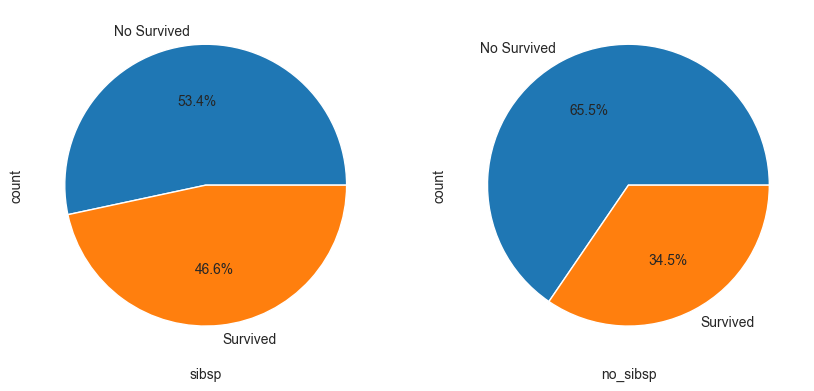

# 2023-数据科学导论实验报告

[TOC]

- **比赛名称**：[kaggle-Titanic](https://www.kaggle.com/competitions/titanic/overview)
- **队伍名**：以个人形式提交，用户名tinykevin
- **实验结果及比赛排名**：
  - 正确率：78.2%
  - 排名：3387/16266

## 问题定义

## 做题思路

### 数据分析

#### 一、原始数据分析
观察数据集，发现数据集中有以下几个特征：
|特征|含义|
|:---:|:---:|
|PassengerId|乘客编号|
|Survived|是否幸存|
|Pclass|船票等级|
|Name|乘客姓名|
|Sex|乘客性别|
|Age|乘客年龄|
|SibSp|亲戚数量（兄妹、配偶数）|
|Parch|亲戚数量（父母、子女数）|
|Ticket|船票号码|
|Fare|船票价格|
|Cabin|船舱|
|Embarked|登船港口|

使用命令`df.info()`查看数据集的基本信息，结果如下：

```
<class 'pandas.core.frame.DataFrame'>
RangeIndex: 891 entries, 0 to 890
Data columns (total 12 columns):
 #   Column       Non-Null Count  Dtype  
---  ------       --------------  -----  
 0   PassengerId  891 non-null    int64  
 1   Survived     891 non-null    int64  
 2   Pclass       891 non-null    int64  
 3   Name         891 non-null    object 
 4   Sex          891 non-null    object 
 5   Age          714 non-null    float64
 6   SibSp        891 non-null    int64  
 7   Parch        891 non-null    int64  
 8   Ticket       891 non-null    object 
 9   Fare         891 non-null    float64
 10  Cabin        204 non-null    object 
 11  Embarked     889 non-null    object 
dtypes: float64(2), int64(5), object(5)
memory usage: 83.7+ KB

```

可以发现，数据集中如下的特点：
- 共有891条数据，数据量较小，训练用时不会太长。
- 特征存在缺失值需要完成补全、修改或舍弃。
- 可能存在无关特征，如名字、称呼等
- 特征中存在字符串，如有需要可转换为数值类型
- 数据集中特征的取值范围不一，如年龄的取值范围为0-80，而船票价格的取值范围为0-512，这可能会影响模型的训练效果，需要进行归一化处理。
- 数据集特征的值不能完全反映乘客的生存情况，考虑新的特征，如家庭成员数、家庭成员是否全部遇难等。

#### 二、数据可视化分析

> 显然，我们不能直接将原始数据输入模型进行训练，需要对数据进行预处理，包括数据清洗、特征提取、特征选择、特征变换等。在进行数据预处理之前，我们需要对数据进行可视化分析，以便更好地理解数据，为后续的数据预处理提供依据。

##### 1. 性别与生存率的关系
作出性别(sex)与生存率的柱状图如下：


从图中可以看出，女性的生存率明显高于男性，可能是 **Lady First**的观点导致的，那么预测时可以将sex作为一个重要的特征。

##### 2. 船票等级与生存率的关系
作出船票等级(Pclass)与生存率的柱状图如下：


从图中可以看出，船票等级越高，生存率越高，可能是因为船票等级越高，船舱越好，逃生时的优先级越高，那么预测时可以将Pclass作为一个重要的特征。

##### 3. 年龄与生存率的关系
作出年龄(Age)与生存率的分布图如下：


从图中可以看出，不同年龄的生存率差异较大，儿童的生存率较高，而青壮年的生存率较低，可能是因为儿童的逃生优先级较高，而青壮年的逃生优先级较低。

另外，作出不同年龄人群的生存率的直方图如下：


上图也从另一方面反映了个年龄人群的生存率差异较大，那么预测时可以将Age作为一个重要的特征。

##### 4. 家庭情况与生存率的关系
作出家庭成员数(SibSp+Parch)与生存率的饼状图如下：



可以看到有无家庭成员的生存率差异较大，但是仅仅考虑有无家庭成员显然是不够的，因为有家庭成员的人数不同，生存率也不同，所以我们将家庭成员数(SibSp+Parch+1)作为一个新的特征进行进一步的分析，作出相关柱状图如下：


同我们之前的分析，家庭成员数也较为明显的影响了生存率，那么预测时可以将家庭成员数作为一个重要的特征。

##### 5. 票价与生存率的关系
作出票价(Fare)的分布以及不同船票等级与票价的关系如下：


作出生存与否人群的票价均值和方差如下：


从上图可以看出，存活与非存活人群间的票价均值和方差差异较大，另一方面，票价与船票等级有较大的关系，所以预测时Fare与Pclass的重要性需要权衡。

##### 6. 登船港口与生存率的关系
作出登船港口(Embarked)与生存人数的柱状图如下：


从图中可以看出，登船港口与生存率有一定的关系，原因可能是不同港口登船的人对船的熟悉程度存在差异，因此预测时Embarked也可以作为一个重要的特征。

##### 7. 名字与生存率的关系
直觉上名字(Name)与生存率没有关系，但是由于严谨性，我们将名字的长度作为一个特征，作出名字长度与生存率的直方图如下：


令人吃惊的是，名字长度与生存率也存在一定的关系，所以我们将名字长度也作为一个重要特征备选项。

##### 8. 船舱与生存率的关系
船舱特征的最大问题在于缺失值太多，无法作出有效的填充，但是我们本着最大化利用数据集的原则，将船舱特征进行了额外的处理，将船舱特征分为有船舱和无船舱两类，作出有无船舱与生存率的柱状图如下：


从图中可以看出，有无船舱信息与生存率也存在一定的关系，所以我们将有无船舱也作为一个重要特征。

##### 9. 称呼与生存率的关系
作出称呼与生存率的柱状图如下：


从图中可以看出，称呼与生存率也存在一定的关系，这可能是因为称呼实际上可以反映一部分的个人信息，如：性别、婚姻、职业等，所以预测时Title也可以作为一个重要的特征。

##### 可视化分析总结
我们对数据集的特征做了可视化分析，发现Sex、Pclass、Age、FamilyNum、Fare、Embarked、NameLen、Cabin、Title，这些特征都与生存率有一定的关系，这几乎利用了全部的数据集信息。在这些特征中，一些是符合直觉的，还有一些是不符合直觉的，但是我们都可以从可视化分析中得到这些特征与生存率的关系，显然说明了数据可视化分析的重要性。

而之后我们将进行数据预处理，将这些特征进行提取、变换、选择等，以便更好地训练模型。

### 特征工程

## 模型选择

### 模型简介

### 模型评估

### 模型调参

## 实验分工与个人感悟

### 实验分工

### 个人感悟——宋神

### 个人感悟——杨神

### 个人感悟——罗胤玻

