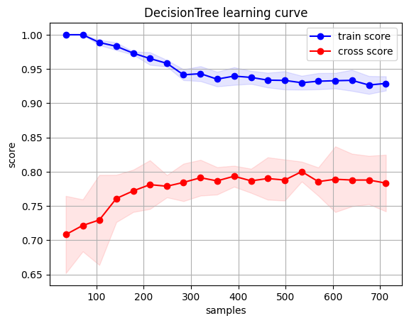

# 2023-数据科学导论实验报告

[TOC]

- **比赛名称**：[kaggle-Titanic](https://www.kaggle.com/competitions/titanic/overview)
- **队伍名**：以个人形式提交，用户名tinykevin
- **实验结果及比赛排名**：
  - 正确率：78.2%
  - 排名：2224/16266
- **源代码** [github仓库](https://github.com/Origami-B/Kaggle-Titanic)

## 问题定义

Titanic - Machine Learning from Disaster是一个经典的机器学习入门问题。该比赛中参赛者需要根据比赛给出的一位乘客的信息(姓名，性别，年龄，称呼，票价等)预测该乘客是否幸存。

## 做题思路
- **数据分析**：首先通过可视化的工具对训练集进行分析
- **特征提取**：通过第一步的分析提取特征
- **模型选择**：选择合适的模型对提取的特征学习并预测
- **调整参数**：对第三步选择的多种模型进行融合，根据训练的结果进行调优

### 数据分析

#### 一、原始数据分析
观察数据集，发现数据集中有以下几个特征：
|特征|含义|
|:---:|:---:|
|PassengerId|乘客编号|
|Survived|是否幸存|
|Pclass|船票等级|
|Name|乘客姓名|
|Sex|乘客性别|
|Age|乘客年龄|
|SibSp|亲戚数量（兄妹、配偶数）|
|Parch|亲戚数量（父母、子女数）|
|Ticket|船票号码|
|Fare|船票价格|
|Cabin|船舱|
|Embarked|登船港口|

使用命令`df.info()`查看数据集的基本信息，结果如下：

```
<class 'pandas.core.frame.DataFrame'>
RangeIndex: 891 entries, 0 to 890
Data columns (total 12 columns):
 #   Column       Non-Null Count  Dtype  
---  ------       --------------  -----  
 0   PassengerId  891 non-null    int64  
 1   Survived     891 non-null    int64  
 2   Pclass       891 non-null    int64  
 3   Name         891 non-null    object 
 4   Sex          891 non-null    object 
 5   Age          714 non-null    float64
 6   SibSp        891 non-null    int64  
 7   Parch        891 non-null    int64  
 8   Ticket       891 non-null    object 
 9   Fare         891 non-null    float64
 10  Cabin        204 non-null    object 
 11  Embarked     889 non-null    object 
dtypes: float64(2), int64(5), object(5)
memory usage: 83.7+ KB

```

可以发现，数据集中如下的特点：
- 共有891条数据，数据量较小，训练用时不会太长。
- 特征存在缺失值需要完成补全、修改或舍弃。
- 可能存在无关特征，如名字、称呼等
- 特征中存在字符串，如有需要可转换为数值类型
- 数据集中特征的取值范围不一，如年龄的取值范围为0-80，而船票价格的取值范围为0-512，这可能会影响模型的训练效果，需要进行归一化处理。
- 数据集特征的值不能完全反映乘客的生存情况，考虑新的特征，如家庭成员数、家庭成员是否全部遇难等。

#### 二、数据可视化分析

> 显然，我们不能直接将原始数据输入模型进行训练，需要对数据进行预处理，包括数据清洗、特征提取、特征选择、特征变换等。在进行数据预处理之前，我们需要对数据进行可视化分析，以便更好地理解数据，为后续的数据预处理提供依据。

##### 1. 性别与生存率的关系
作出性别(sex)与生存率的柱状图如下：


从图中可以看出，女性的生存率明显高于男性，可能是 **Lady First**的观点导致的，那么预测时可以将sex作为一个重要的特征。

##### 2. 船票等级与生存率的关系
作出船票等级(Pclass)与生存率的柱状图如下：


从图中可以看出，船票等级越高，生存率越高，可能是因为船票等级越高，船舱越好，逃生时的优先级越高，那么预测时可以将Pclass作为一个重要的特征。

##### 3. 年龄与生存率的关系
作出年龄(Age)与生存率的分布图如下：


从图中可以看出，不同年龄的生存率差异较大，儿童的生存率较高，而青壮年的生存率较低，可能是因为儿童的逃生优先级较高，而青壮年的逃生优先级较低。

另外，作出不同年龄人群的生存率的直方图如下：


上图也从另一方面反映了个年龄人群的生存率差异较大，那么预测时可以将Age作为一个重要的特征。

##### 4. 家庭情况与生存率的关系
作出家庭成员数(SibSp+Parch)与生存率的饼状图如下：


可以看到有无家庭成员的生存率差异较大，但是仅仅考虑有无家庭成员显然是不够的，因为有家庭成员的人数不同，生存率也不同，所以我们将家庭成员数(SibSp+Parch+1)作为一个新的特征进行进一步的分析，作出相关柱状图如下：


同我们之前的分析，家庭成员数也较为明显的影响了生存率，那么预测时可以将家庭成员数作为一个重要的特征。

##### 5. 票价与生存率的关系
作出票价(Fare)的分布以及不同船票等级与票价的关系如下：


作出生存与否人群的票价均值和方差如下：


从上图可以看出，存活与非存活人群间的票价均值和方差差异较大，另一方面，票价与船票等级有较大的关系，所以预测时Fare与Pclass的重要性需要权衡。

##### 6. 登船港口与生存率的关系
作出登船港口(Embarked)与生存人数的柱状图如下：


从图中可以看出，登船港口与生存率有一定的关系，原因可能是不同港口登船的人对船的熟悉程度存在差异，因此预测时Embarked也可以作为一个重要的特征。

##### 7. 名字与生存率的关系
直觉上名字(Name)与生存率没有关系，但是由于严谨性，我们将名字的长度作为一个特征，作出名字长度与生存率的直方图如下：


令人吃惊的是，名字长度与生存率也存在一定的关系，所以我们将名字长度也作为一个重要特征备选项。

##### 8. 船舱与生存率的关系
船舱特征的最大问题在于缺失值太多，无法作出有效的填充，但是我们本着最大化利用数据集的原则，将船舱特征进行了额外的处理，将船舱特征分为有船舱和无船舱两类，作出有无船舱与生存率的柱状图如下：


从图中可以看出，有无船舱信息与生存率也存在一定的关系，所以我们将有无船舱也作为一个重要特征。

##### 9. 称呼与生存率的关系
作出称呼与生存率的柱状图如下：


从图中可以看出，称呼与生存率也存在一定的关系，这可能是因为称呼实际上可以反映一部分的个人信息，如：性别、婚姻、职业等，所以预测时Title也可以作为一个重要的特征。

##### 可视化分析总结
我们对数据集的特征做了可视化分析，发现Sex、Pclass、Age、FamilyNum、Fare、Embarked、NameLen、Cabin、Title，这些特征都与生存率有一定的关系，这几乎利用了全部的数据集信息。在这些特征中，一些是符合直觉的，还有一些是不符合直觉的，但是我们都可以从可视化分析中得到这些特征与生存率的关系，显然说明了数据可视化分析的重要性。

而之后我们将进行数据预处理，将这些特征进行提取、变换、选择等，以便更好地训练模型。

### 特征工程

#### 数据预处理
在之前的可视化分析中，我们对数据集中各类数据做了初步的观察，选择了一些与最终存活率密切相关的特征，但是在这些特征中，有一些特征存在缺失值，有一些特征是字符串，有一些特征的取值范围不一，这些都需要我们进行数据预处理。

##### 1. 年龄(Age)特征处理
年龄的数据的问题有二：一是年龄的数据存在缺失值，二是年龄的数据的取值范围过大，我们将分别对这两个问题进行处理。

- **年龄缺失值预测：** 使用随机森林算法对年龄的缺失值进行预测，使用的特征有：Pclass、SibSp、Parch、Fare、NameLen、Title、Sex、Embarked。使用随机森林算法的原因是：一是随机森林算法对缺失值不敏感，二是随机森林算法可以同时处理数值型和字符串型的数据。
- **年龄归一化处理：** 由于年龄的取值范围过大，我们将年龄进行归一化处理。

##### 2. 船票价格(Fare)特征处理
船票价格仅有一个缺失值，鉴于票价与船票等级的相关性，我们以不同Pclass的船票均价来进行填充，而后对船票作归一化处理

##### 3. 家庭成员数(FamilyNum)特征处理
由于家庭成员数是由SibSp和Parch相加得到的，所以我们不需要对FamilyNum进行处理。

##### 4. 登船港口(Embarked)特征处理
登船港口的数据存在缺失值，我们使用众数进行填充。

##### 5. 称呼(Title)特征处理
这里的称呼有很多，可以使用独热码进行编码，但是观察数据后我们决定将称呼分为以下几类：
- 工作称呼：`['Capt', 'Col', 'Major', 'Dr', 'Rev'], 'Officer'`
- 敬称：`['Don', 'Sir', 'the Countess', 'Dona', 'Lady'], 'Royalty'`
- 已婚女士：`['Mme', 'Ms', 'Mrs'], 'Mrs'`
- 未婚女士：`['Mlle', 'Miss'], 'Miss'`
- 男士：`['Mrs'], 'Mrs'`
- 硕士：`['Master'], 'Master'`

##### 6. 船舱(Cabin)特征处理
船舱的数据存在缺失值，我们将缺失值填充为`'U'`，表示未知。

##### 7. 其他特征处理
其他特征，比如：Sex、Pclass等都不是数值型的，我们使用独热码进行编码。

------

#### 特征选择

在手动提取了许多数据集的特征之后对特征进行了一些挑选。首先对提取的特征之间的关联进行分析，热力图如下。


我们通过该关联性的热力图可以看到许多和推测契合的特征关联性以及在特征提取中参考前人工作时一些觉得不合理但在关联性图中得到解释的特征。
比如Name_length这一特征在很多关于Kaggle-Titanic比赛中都有所提到。起初我们非常不解不过现在在进行特征间相关度分析后得到了解释。Name_length和性别有很大的关系，这就不难解释该特征在判断乘客是否存货中起到相当重要的作用。
另外如特征Cabin也就是舱位由于非常多样也有非常多的缺失，我们将是否拥有舱位作为特征Cabin在关联热力图中我们发现舱位和票价有较大的关系，在之前的分析中票和生存率也有一定关联。推测是因为比较高级的票才有舱位，也许廉价的舱位并没有舱位一说。

另外我们也对各个特征的重要性进行了排序


由特征的重要性看排在其中特征的重要性和我们推测的非常契合，是否能够生存和性别年龄以及是否有家人在船上有很重要的关系，并且我们提取的许多特征如名字长度缺失也起到了很高的重要程度。


### 模型简介
本次实验使用了较为常见的分类器并且对其单独预测以及融合进行了评估。在本次实验中使用了多种分类器，分别是决策树、随机森林、极端随机树、adaboost、最近邻、逻辑回归以及支持向量机，下面对各个模型进行简单的介绍。

#### 决策树
决策树是一种用于分类和回归的监督学习算法。它通过对数据集进行递归地划分，以创建一个树形结构，其中每个内部节点表示一个特征或属性上的测试，每个分支代表一个测试输出，而每个叶节点代表一个类别标签或者一个数值。在分类问题中，决策树通过对特征进行划分来逐步确定最终的类别；在回归问题中，决策树通过对特征进行划分来逐步确定最终的数值。决策树时一种非常符合直觉的模型，并且较善于处理数值类别的特征。
#### 随机森林
随机森林分类器是一种集成学习方法，它由多个决策树组成。在训练过程中，每棵决策树都会使用随机选择的特征和样本来进行训练，这样可以减少过拟合的风险。在进行分类时，随机森林会将每棵树的分类结果进行投票，然后选择投票最多的类别作为最终的分类结果，对于处理缺失数据和异常值也有一定的鲁棒性
#### 极端随机树
类似于随机森林，极端随机树也是一种集成学习的方法。它也由多棵决策树组成，但在构建每棵树的过程中，它使用了更多的随机性。具体来说，对于每个节点的特征划分，极端随机树会随机选择特征的划分阈值，而不是像随机森林那样通过对特征的随机子集进行划分。这种方法可以降低模型的方差，加快训练速度，并且对于噪声数据更加鲁棒。
#### AdaBoost
同样也是一种集成学习的方法。AdaBoost通过反复训练一系列弱分类器（比如决策树或者神经网络），每一次训练都会调整数据的权重，使得之前分类错误的样本在下一次训练中得到更多的关注。最终，Adaboost会将这些弱分类器组合成一个强分类器，通过对每个弱分类器的结果进行加权投票来进行最终的分类。
#### GradientBoost
Gradient Boosting分类器是一种集成学习方法，它通过迭代地训练一系列弱分类器（通常是决策树），每一次训练都会根据上一轮的预测结果来调整数据的权重，以便更好地拟合残差。最终，这些弱分类器会被组合成一个强分类器，通过对每个弱分类器的结果进行加权求和来进行最终的预测。
#### SVM
向量支持机是一种用于分类和回归的监督学习算法。在分类问题中，SVM的目标是找到一个最优的超平面，能够将不同类别的样本分开。在回归问题中，SVM的目标是找到一个超平面，使得训练数据点到该超平面的距离尽可能地小。之后通过超平面将向量构成的超空间分为多个子空间，被分到不同子空间的样本可以看作一类。
#### 逻辑回归
逻辑回归模型是最常用的二分类模型，其通过一个逻辑函数（也称为Sigmoid函数）来对样本进行分类。逻辑回归模型的输出是一个介于0和1之间的概率值，表示样本属于某个类别的概率。当这个概率值大于0.5时，样本被划分为正类；当概率值小于0.5时，样本被划分为负类。
#### 最近邻
决策树是一种用于分类和回归的监督学习算法。它通过对数据集进行递归地划分，以创建一个树形结构，其中每个内部节点表示一个特征或属性上的测试，每个分支代表一个测试输出，而每个叶节点代表一个类别标签或者一个数值。在分类问题中，决策树通过对特征进行划分来逐步确定最终的类别。

另外我们还使用了简单的投票器以及bagging两种模型融合方式进行训练。以下为两种模型融合的简介。

#### Voting
简单地把多个模型的投票进行加权平均，在本次实验中可以看作选取判断为生存或者遇难模型数更多的结果。

#### Bagging
采用有放回的方式进行抽样，用抽样的样本建立子模型,对子模型进行训练，这个过程重复多次，最后进行融合。

### 模型评估
首先我们通过k-fold方法对上述所有模型进行了评估(k-fold值为10)，其中评估的平均得分如下


仅从给定的训练集中看最随机森林的效果是最好的，另外我们对各个模型的学习曲线进行观察（结果如下），可以看出有部分模型训练效果较好，但是有些模型如决策树等模型仍处于欠拟合的状态，于是我们尝试对参数进行调整取得了一些效果。
<figure>




</figure>

<figure>


</figure>
<figure>


</figure>

### 模型调整

<<<<<<< HEAD
#### 初步调整

对于过拟合的Knn将其neighbors增大也就是在knn判断时有更多的临近点可以判断，那么将一定程度上可以避免过拟合的发生。

对于欠拟合的GradientBoosting，由于数据集相对较小所以提高了其学习率使其可以在相对较小的训练集中找到更优解。

对于欠拟合的DecisionTree调整参数发现树深度为3时有较好的学习曲线。

以下为调整后的学习曲线。我们可以看出，学习曲线均有上升，对于参数的调整都有了一定的效果。其中knn的参数调整效果最好，决策树的参数调整效果次之，GradientBoosting则上升较少。
<figure>


</figure>

通过初步的模型参数调整提交了各个模型预测的文件结果如下，以官网所给的仅以性别区分的准确度为baseline为以下模型的准确率。


<<<<<<< HEAD
从上表中可以看出仅从性别预测已经有较高的正确率，进一步说明了之前对于features的评估中性别有相当高的权重。另外我们还可以发现各个模型对于测试集的正确率比之前在k-fold下各个模型对于验证集的正确率低且不同模型间正确率的排名有了变化。推断是验证集和训练集更加相似所以验证集上的评分更高并且各个模型泛化能力不同，所以验证集的正确率排名和测试集正确率排名各个模型间有一定的不同。不过相对于baseline都没有明显的提升，猜测有以下几个原因影响了各个模型预测的准确性。1，我们在数据整形中有不合理之处，如在年龄的2，模型仍有不足需要改进，可以通过混淆矩阵等方法量化模型并且进行改进。
=======
从上表中可以看出仅从性别预测已经有较高的正确率，进一步说明了之前对于features的评估中性别有相当高的权重。另外我们还可以发现各个模型对于测试集的正确率比之前在k-fold下各个模型对于验证集的正确率低且不同模型间正确率的排名有了变化。推断是验证集和训练集更加相似所以验证集上的评分更高并且各个模型泛化能力不同，所以验证集的正确率排名和测试集正确率排名各个模型间有一定的不同。
=======
在此处kaggle赛事中，较为重要的两部分为：

- 特征工程

- 模型调参

特征工程在上面已经进行了详细的介绍，这里主要介绍模型调参的过程。

#### 1. 模型调参的方法


## 实验分工与个人感悟

### 实验分工
### 个人感悟——宋林恺
本次实验我们组成员都是第一次接触数据挖掘领域，没有数据挖掘和机器学习相关的基础所以选择了最经典的Titanic问题。该问题的参考较多，可以较为顺利地走完从数据处理到模型训练的全过程。总体来说虽然Kaggle-Titanic问题比较简单参考也很多，但是动手操作进行全流程的工作还是有很大的收获。
#### 数据挖掘部分
这次实验中我进行了部分的数据整形工作，在数据整形工作中主要是将缺失值填充。其中怎样进行填充就有一定的方法，我们使用不同的统计学方法对缺失的数据进行填充使经过数据整形后的数据既能填补上缺失部分也不会对之后的学习有误导性质。
在特征工程中我没有进行太多的工作，不过也深入地与进行特征工程的罗胤玻进行了讨论以及学习。我觉得特征工程是一个非常有趣的工作，在提取特征时需要进行头脑风暴人工地去提取。在本次实验中我们为了提高提取特征的可用性我们也参考了许多网上资料提取了一些远远超出我们思维的特征。如相在看到后觉得合理但是没有想到的"称谓"，该特征可以体现出一个人的社会关系。如"Mrs"为婚后女性，"Miss"为女性"Doctor"为医生或者博士都有可能和是否逃生有一定的关系。如名字长度作为特征，该特征在特征在评估中还有相当高的权重。起初我们非常不解，不过在进行特证间的关系之后发现名字长度和性别有很大的关系。显然女性有更高概率幸存名字长度成为一个重要的特征确实有一定道理。特征工程还需将特征转换为模型可以学习的类型，本次用的模型都只能对数值类型的特征，所以可以将类别转换为独热码等等。
#### 模型构建部分
模型的构建主要由我负责，为了更加全面体会各个模型我使用了多个模型并且用到了非常多上课讲到的方法进行调整。在本次实验中对于各个模型都有了初步的了解，对于一个之前并没有接触过人工智能的同学来说收获非常多大。并且在实践中用到了许多课上讲解的知识对模型进行了初步的调优。如在观察了学习曲线后发现knn设置的neighbors也许过于少导致过拟合，于是将neighbors增大得到了较好的knn学习曲线，正确率也从0.744变为0.787有了很大的提升。不过如决策树在调整了决策树的叶子数量以及深度后虽然学习曲线从过拟合的状态转变为拟合更加合适的状态正确率也有一定的上升0.744->0.758。

### 个人感悟——杨神

### 个人感悟——罗神

